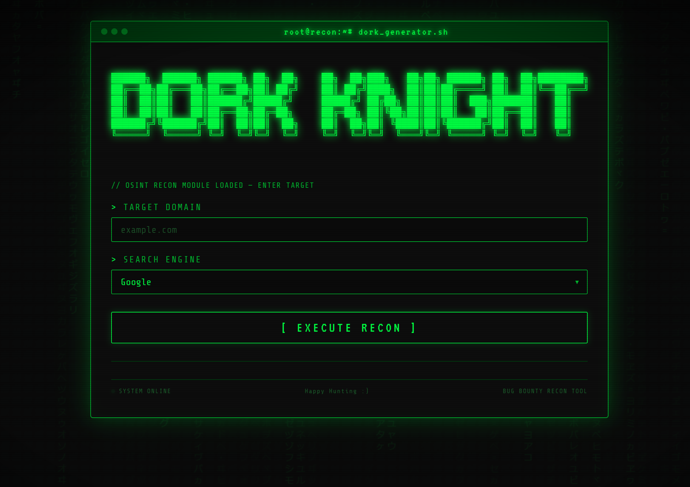

# Dork-Knight 🛡️ 

> **Generate powerful search engine dorks for bug bounty hunting, OSINT, and reconnaissance — right from your browser.**



## Overview

Dork-Knight is a lightweight, browser-based utility that generates categorized search engine dorks for a target domain.

Simply enter a domain, choose a search engine, and Dork-Knight builds ready-to-use search queries that can help during reconnaissance and OSINT phases of authorized security assessments.

No installation.
No backend.
No tracking.
No data collection.

Everything runs entirely in your browser.

---

## Live Demo

> https://Ali-Khoshroo.github.io/dork-knight/

---

## Supported Search Engines

* Google
* Bing
* DuckDuckGo
* Yandex

---

## Running Locally

Clone the repository:

```bash
git clone https://github.com/Ali-Khoshroo/dork-knight.git
```

Open:

```text
index.html
```

in any modern browser.

No installation or dependencies are required.

---

## Adding Your Own Dorks

All dorks are stored inside:

```text
dorks.js
```

Each category is defined as a simple object:

```javascript
{
    title: "General Recon",
    dorks: [
        "site:{domain} inurl:admin",
        "site:{domain} filetype:pdf"
    ]
}
```

`{domain}` is automatically replaced with the target domain entered by the user.

---

## Contributing

Contributions are welcome.

If you have:

* improved search queries
* additional dork categories
* support for more search engines
* bug fixes

feel free to open an Issue or submit a Pull Request.

---

## Disclaimer

This project is intended for educational purposes, defensive security research, authorized penetration testing, bug bounty programs, and OSINT activities.

Always ensure you have permission to assess the systems you target and comply with the applicable terms of service of the search engines you use. The author is not responsible for any misuse of this project.

---

## License

This project is licensed under the MIT License.

---

## Acknowledgements

Many of the search queries included in this project were inspired by publicly available security research, bug bounty write-ups, and community-shared reconnaissance techniques. Thanks to the researchers who openly share their knowledge and help advance the security community.
